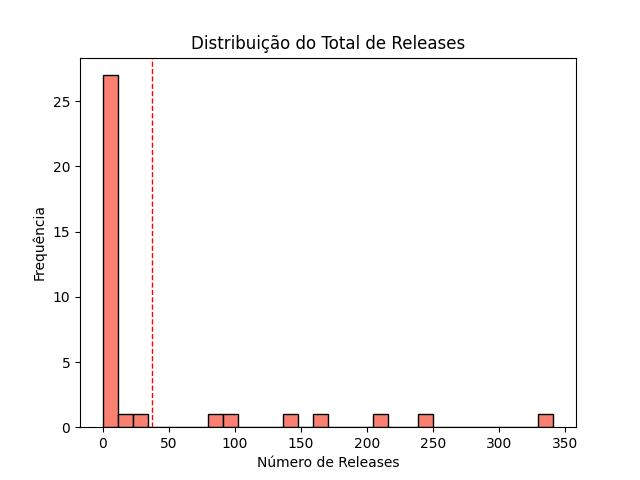
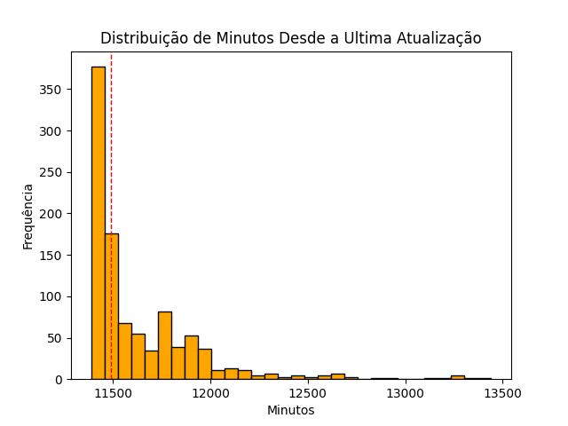
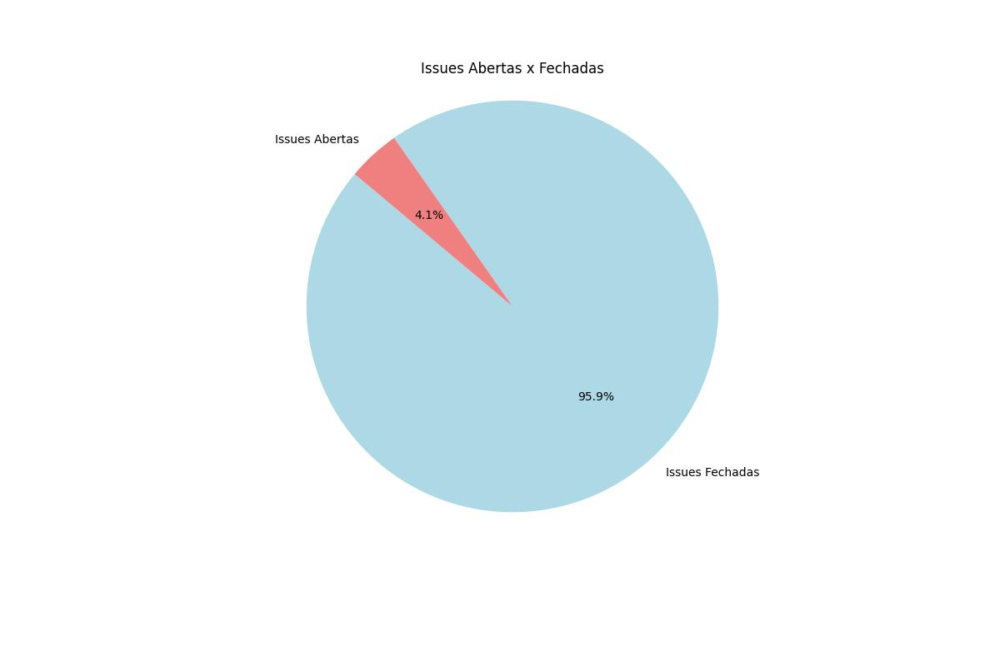

# Análise de Repositórios Populares de Código Aberto no GitHub

## 1. Introdução

Neste trabalho, foi realizada uma análise dos 1.000 repositórios mais populares do GitHub de acordo com o número de estrelas com o objetivo de avaliar suas características e padrões de desenvolvimento observados. Para isso, o estudo foi guiado a partir das seguintes perguntas de pesquisa (RQ, do inglês "Research Questions"):

- **RQ 01**: Sistemas populares são maduros/antigos?
- **RQ 02**: Sistemas populares recebem muita contribuição externa?
- **RQ 03**: Sistemas populares lançam releases com frequência?
- **RQ 04**: Sistemas populares são atualizados com frequência?
- **RQ 05**: Sistemas populares são escritos nas linguagens mais populares?
- **RQ 06**: Sistemas populares possuem um alto percentual de issues fechadas?


## 2. Hipóteses Informais

De forma preliminar, elaborou-se as seguintes hipóteses informais para posterior verificação:

- Espera-se que a maioria dos sistemas populares seja madura e sua criação tenha ocorrido, no mínimo, há 3 anos.
- Espera-se que repositórios populares recebam muitas contribuições externas, refletidas no número de pull requests aceitas.
- Espera-se que a maioria desses sistemas lance releases com regularidade mínima de 3 meses.
- Espera-se que os repositórios sejam atualizados com frequência mínima de 1 semana.
- Espera-se que prevaleçam linguagens como JavaScript, Python, e Java — que estão entre as tecnologias mais populares segundo a 2024 Developer Survey do Stack Overflow[^1].
- Espera-se que a maioria dos sistemas populares possua um alto percentual de issues fechadas, de 75% ou mais.

[^1]: Technology | 2024 Stack Overflow Developer Survey. Disponível em: <https://survey.stackoverflow.co/2024/technology#most-popular-technologies-language-prof>.

## 3. Metodologia

 A coleta de dados foi realizada a partir da API do GitHub e implementada via GraphQL, buscando os 1.000 repositórios com maior número de estrelas. As seguintes métricas foram utilizadas para cada pergunta de pesquisa:

#### RQ-01: "Os sistemas populares são maduros/antigos?"
- `created_at_median`: valor mediano de dias desde a criação dos 1.000 principais repositórios GitHub

#### RQ-02: "Os sistemas populares recebem muita contribuição externa?"
- `merged_pull_requests_median`: valor mediano do número de pull requests incorporadas nos 1.000 principais repositórios do GitHub

#### RQ-03: "Os sistemas populares lançam releases com frequência?"
- `total_releases_mean`: valor médio do número de releases nos 1.000 principais repositórios do GitHub

#### RQ-04: "Os sistemas populares são atualizados com frequência?"
- `last_updated_median`: valor mediano de minutos desde a última atualização dos 1.000 principais repositórios do GitHub

#### RQ-05: "Os sistemas populares são escritos nas linguagens mais populares?"

- `main_language`: frequência das principais linguagens de programação usadas nos 1.000 principais repositórios do GitHub

#### RQ-06: "Os sistemas populares possuem um alto percentual de issues fechadas?"

1. `all_issues`: quantidade total de issues dos 1.000 principais repositórios do GitHub
2. `closed_issues`: quantidade de issues fechadas dos 1.000 principais repositórios do GitHub
3. `closed_issues_ratio`: razão de issues fechadas, definido por:
  ```math
    closed\_issues\_ratio = \frac{closed\_issues}{all\_issues}
  ```

- `closed_issues_ratio_median`: mediana das razões de issues fechadas dos 1.000 principais repositórios do GitHub


## 4. Resultados
| **RQ**  | **Métrica**  | **Valor encontrado** |
|---------|--------------|----------------------|
| `RQ-01`   | `created_at_median`         | 2970.0 dias |
| `RQ-02`   | `merged_pull_requests_median` | 1100.5 PRs mergeadas  |
| `RQ-03`   | `total_releases_mean`       | 37.42 releases  |
| `RQ-04`   | `last_updated_median`       | 11444.0 minutos = 190.7 horas |
| `RQ-05`   | `main_language`             | Python (163), JavaScript (157), TypeScript (132), Go (75), Java (59), C++ (51), Rust (36), C (24), Shell (23), Jupyter Notebook (21), HTML (18), C# (14), Ruby (14), Swift (13), Kotlin (10), PHP (9), CSS (8), Vue (6), MDX (6), Dart (5), Markdown (4), Vim Script (4), Clojure (4), Dockerfile (3), TeX (3), Batchfile (2), Zig (2), Scala (2), Assembly (2), Makefile (2), Lua (2), Svelte (2), Haskell (2), Objective-C (2), Nunjucks (1), Julia (1), Astro (1), Roff (1), V (1), SCSS (1), Jinja (1), LLVM (1), Less (1), Elixir (1) |
| `RQ-06`   | `closed_issues_ratio_median` | 95.86% de issues fechadas  |


## 5. Análise de resultados

Ao comparar as hipóteses formuladas com os resultados encontrados através da coleta de dados, pode-se observar:

### 5.1. Popularidade e maturidade dos sistemas (RQ-01)
A hipótese inicial previa que a maioria dos repositórios analisados teriam sido criados há, no mínimo, 3 anos. O valor encontrado (mediana de 2970 dias — aproximadamente 8 anos), corrobora essa expectativa, indicando que, de fato, os sistemas mais populares do GitHub possuem projetos maduros.


### 5.2. Contribuições externas (RQ-02)
Esperava-se que os repositórios populares recebessem muitas contribuições externas, refletidas no número de pull requests aceitas. Com uma mediana de 1100.5 PRs mergeadas, a hipótese inicial foi confirmada.


### 5.3. Frequência de releases (RQ-03)
A hipótese inicial sugeria que os sistemas populares lançassem releases com uma regularidade mínima trimestral. No entanto, com o valor obtido (média de 37.42 releases), não é possível determinar diretamente a periodicidade dos lançamentos. Por outro lado, o número médio de releases sugere uma tendência de evolução constante dos respectivos softwares.



### 5.4. Atualizações frequentes (RQ-04)
Esperava-se que os repositórios fossem atualizados com uma frequência mínima de 1 semana. O valor mediano encontrado foi de 11444 minutos (aproximadamente 190.7 horas ou 7.9 dias). Esse valor, próximo do que foi hipoteticamente formulado, confirma a hipótese inicial e indica que os repositórios análisados estão ativos e em constante recebimento de contribuições.



### 5.5. Linguagens predominantes (RQ-05)
A hipótese inicial sugeria que linguagens como JavaScript, Python e Java predominariam entre os repositórios mais populares. Os resultados confirmam parcialmente essa expectativa, com Python (163), JavaScript (157) e Java (59) entre as linguagens mais usadas. No entanto, TypeScript (132) e Go (75) também apareceram com destaque.


### 5.6. Fechamento de issues (RQ-06)
A expectativa era que a maioria dos sistemas populares possuísse um percentual de issues fechadas de 75%+. O valor mediano encontrado de 95.86% superou essa expectativa, e é indicativo de forte engajamento da comunidade na resolução de problemas.


